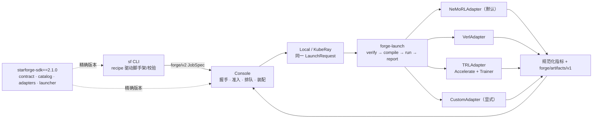

# starforge-cli

StarForge（星锻）的命令行客户端。安装后提供 `sf` 命令（类似 `huggingface-cli` → `hf`）。

**普通用户不需要 clone 本仓库。** 用 pip 安装，再 `sf init` 创建自己的微调项目。

本仓同时是平台团队的 dogfood 项目（`experiments/` 下的示例实验）。贡献 CLI 或复现官方示例时再 clone。

> 训练跑在远程 GPU 容器里，你只在自己机器上提交、看结果，本机无需 GPU。
> 提交统一经 **StarForge 控制平面**：服务端持有集群地址 / 密钥 / 数据目录，本机不直连集群。

## 最快上手（4 步开跑）

```bash
# 1) 安装 CLI（无需 GPU、不必 clone）
pip install starforge-cli          # 或 uv tool install starforge-cli

# 2) 创建自己的微调项目
sf init my-lab --yes
cd my-lab
sf login --server https://<你的 StarForge 域名>

# 3) 新建实验、按需调参
sf new my-grpo --method nemo-rl/grpo
# 编辑 experiments/my-grpo/config.yaml 顶部「调参速查」
sf validate my-grpo

# 4) 提交 → 看结果
sf submit my-grpo --profile h200:8
sf job logs
```

每个实验「调什么 / 数据 / 奖励 / 怎么跑」见其目录下 `README.md`。
官方文档：见 StarForge 控制台站点的「快速开始」。

## 硬件

| Profile | 说明 |
| --- | --- |
| `h200` | 单机 8× NVIDIA H200 141GB（**当前主力**） |
| `h200-2g` | 同机器，只要 2 张卡（小实验 / 调试，别占满集群） |
| `h100` | 单机 1× NVIDIA H100 80GB |

训练配置与硬件解耦：profile 的进程环境（NCCL/显存分配）、框架覆盖项（并行度/vLLM 调优）
与默认资源形状全部由 **Console 服务端硬件注册表**管理，提交时经环境变量注入作业
（`FORGE_PROFILE_OVERRIDES` / profile env），本仓库不再有 `cluster/` 目录。

`--profile` 是唯一的资源入口，格式 `名称[:总卡数]`：

```bash
sf submit <实验名> --profile h200        # 注册表默认形状（1×8）
sf submit <实验名> --profile h200:4      # 同卡型只要 4 张（单节点）
sf submit <实验名> --profile h200:16     # 16 张 = 2 满节点（须整节点倍数）
```

卡型（series）与拓扑细节由注册表补齐，不需要也不能手写。batch/seq/LoRA/显存等超参
都是按某张卡的显存调出来的，每个实验 README 应写明推荐 profile；改形状（如 `h200:2`）时
服务端会提醒 profile 的调优 overrides 按默认形状调校，注意自查并行度。
异构分池是预留扩展位：`--profile train=h200:8 --profile rollout=h100:2`（当前 launcher
仅支持单池同构 world，多池提交会被服务端明确拒绝）。

## 它和控制平面是什么关系

本仓是**客户端**：管实验、改超参、提交、看结果。真正的鉴权 / 配额 / 排队 / 调度
在控制平面 `starforge` 里，本机不直连 Ray。

两边靠一份独立的契约包 `starforge-sdk` 对接（源码在 console 仓的 `sdk/`）：



**这个方向很重要**：CLI、Console、训练镜像三方都只依赖契约包，彼此不互相依赖 ——
本仓发版不会影响服务端。

「一个作业长什么样」是一份带版本的 `JobSpec`，而不是一堆环境变量的隐式约定：

```yaml
apiVersion: forge/v2
kind: TrainingJob
spec:
  recipe:    {name: nemo-rl/grpo, version: 0.7.0, digest: "sha256:…"}
  framework:
    kind: nemo-rl
    version: 0.7.0
    image: "nvcr.io/nvidia/nemo-rl:v0.7.0@sha256:…"
  resources: {pools: [{name: train, series: h200, nodes: 1, gpus_per_node: 8}]}
```

`sf submit` 生成它，服务端据此装配作业。两边各有一份 golden test 钉住这份映射，
契约漂移会在 CI 当场失败，而不是在某次训练跑到一半时。

recipe identity 与 framework runtime identity 分开记录；`recipe.lock.json` v3 固定
recipe bundle digest 和精确 framework version。SDK 只要求满足兼容范围。
锁过期时用 `sf recipe upgrade`，提交过程不会静默改写。`--framework-version`
只能选择 catalog 已发布版本，不接受 `latest`、范围或分支。

**加一种后训练方法不需要改本仓代码** —— 方法定义在 SDK 的
`recipes/catalog/<framework>/<recipe>/` 两级目录里，
`sf methods` 列的就是它。

生产环境从 Nexus 安装精确的 `starforge-sdk==2.1.0`；开发环境由 `pyproject.toml` 的
editable path 指向 console 仓的 `sdk/`。提交前会与 Console 做精确 catalog 握手，
不匹配时在打包之前失败。

## 目录结构

```
starforge-cli/                 # 本仓 = CLI 源码 + 平台 dogfood 项目
├── sf                         # 源码仓薄 shim（= uv run sf）；用户装 pip 包后不需要
├── starforge_cli/             # CLI 实现（Typer）；scaffold/ 随 wheel 分发
│   └── scaffold/              # sf init 模板、实验骨架、scripts/launch.sh
├── starforge.yaml             # dogfood 项目标记（sf 发现项目根）
├── pyproject.toml             # 包元数据 + [project.scripts] sf
├── experiments/               # dogfood 示例实验（用户项目由 sf init / sf new 生成）
├── configs/                   # dogfood 用的基底（用户项目从 scaffold 拷出）
└── common/                    # dogfood 共享代码
```

用户经 `sf init` 得到的项目只有 `starforge.yaml` + `experiments/` + `configs/` + `common/`，
没有 CLI 源码。`scripts/launch.sh` 在提交打包时由已安装的 CLI 注入。

> NeMo-RL 配置工作流：每个实验有自己的 `config.yaml`，通过 `defaults` **继承基底 + 模型片段，只写差异**。
> recipe 固定入口，adapter 读取该配置并叠加服务端下发的 profile 覆盖项（`FORGE_PROFILE_OVERRIDES`）；
> 实验目录不再拥有 `run.sh` 或可覆盖入口。verl、TRL、custom 使用各自 recipe 模板和校验器。

## experiments vs projects

- **`experiments/`**：练习、调参、试错、复现。允许快糙猛，但每个目录必须有 `README.md` 记录目标、结论、SwanLab 链接。
- **`projects/`**：正式项目，要求可复现：固定依赖、固定数据版本、完整 eval、产出 checkpoint 导出流程。

两者内部目录布局一致（见 CLI 包内 `starforge_cli/scaffold/experiment-template/`），区别只是成熟度要求。

## 命名规范（核心）

每个实验目录统一命名为：

```
<method>_<model>_<dataset>[_<tag>]
```

- `method`：`sft` | `grpo` | `dpo` | `ppo` | `rm`（奖励模型）| `agent-grpo`（多轮 Agent）
- `model`：`qwen3.5-4b` | `qwen3.5-9b` | ...
- `dataset`：`gsm8k` | `alpaca` | `toolbench` | ...
- `tag`：可选，`v1` / `v2` 或日期 `20260602`

示例：

```
sft_qwen3.5-4b_alpaca_v1
grpo_qwen3.5-9b_gsm8k_v2
agent-grpo_qwen3.5-9b_toolbench_v1
```

字段间用 `_` 分隔，字段内（如模型名 `qwen3.5-4b`）用 `-`，避免歧义。完整规则见 [`docs/naming-convention.md`](docs/naming-convention.md)。

## 统一 CLI（`sf`）

所有操作都通过 `sf` 入口（[Typer](https://typer.tiangolo.com) 实现，纯 Python，**macOS / Linux / Windows 完全兼容**）：

```bash
sf login                                    # 接入 StarForge 服务
uv run sf ls                                # 列出实验 / 项目
uv run sf methods                           # 有哪些后训练方法、各自能调什么超参（--method 的取值来源）
uv run sf new grpo_qwen3.5-4b_gsm8k_v1 --method nemo-rl/grpo   # 从骨架新建实验
uv run sf dataset prepare gsm8k             # 本地预处理数据集（gsm8k / alpaca / qa_rl / opsd_math）
uv run sf dataset push qa-rl v1 ./out       # 上传数据集版本（默认私有；--public 公开给所有人）
uv run sf dataset ls                        # 可见的数据集（公开的 + 自己的），ID 为 <owner>/<name>
uv run sf dataset visibility alice/qa-rl --public   # 改可见性（owner 或 admin）
uv run sf status                            # 账号 / 配额 / 用量 / 活跃作业（submit 前预检，别撞满卡）
uv run sf validate grpo_qwen3.5-4b_gsm8k_v1 # 提交前静态校验 config（本地秒级，省得跑到集群才报错）
uv run sf submit agent-grpo_qwen3.5-9b_multitool_v1   # 经服务端提交作业到集群（提交前自动校验）
# 训练引用平台数据集：config 里声明 data.train.dataset: alice/qa-rl@v1（submit 自动拾取，
# 作业启动时拉到共享缓存并注入 QA_RL_DATA_DIR）；--train-dataset 仅作临时覆盖：
uv run sf submit <实验> --train-dataset alice/qa-rl@v2
# verl/TRL 同样支持：声明数据集后 --train-data 写数据集内的相对文件名，作业侧自动解析到缓存：
uv run sf submit verl-grpo_xxx --train-data train.parquet --validation-data val.parquet
uv run sf job ls                            # 我的作业列表 + 提交历史（--all 看全部，--exp 过滤）
uv run sf job logs                          # 跟随最近一个作业日志（可指定作业 ID）
uv run sf export grpo_qwen3.5-9b_gsm8k_v1   # 训练后：把 checkpoint 转 HF（自适应 dcp/megatron），可 --push-repo 推 Hub
uv run sf eval grpo_qwen3.5-9b_gsm8k_v1     # 训练后：对 checkpoint 跑独立评测（未给 --model 时先自动导出）
uv run sf job stop <job_id>                 # 停止运行中的作业
```

> 首次使用：`uv run sf login` 接入官方 Lab 服务，再 `uv run sf status` 确认身份与配额，然后 `sf submit`。
> 提交一律经服务端代理：Ray 地址 / 密钥 / 数据目录都在服务端，本机不直连 Ray、无需任何 `submit.env`。
> 每次 `sf submit` 会自动：① 校验 config（batch 三者相等等，不过不放行，可 `--no-validate` 跳过）；
> ② 只打包运行时清单（实验目录 + common/ + configs/ + launch.sh；profile 的 env/overrides 由服务端注入），
> 工作区有未提交改动时拒绝提交（`--allow-dirty` 显式确认）；
> ③ 由服务端记录 git commit / dirty / config 指纹与 `run_id`。
> 事后 `sf job ls` 对上作业状态（RUNNING/SUCCEEDED/FAILED…）。

调用方式：

| 方式 | 说明 |
| --- | --- |
| `sf ...` | **推荐**：`pip install starforge-cli` 或 `uv tool install starforge-cli` 之后 |
| `uv run sf ...` | 在本源码仓开发时；uv 使用本仓环境 |
| `./sf ...` | 本仓根的薄 shim，内部就是 `uv run sf` |

`sf <子命令> --help` 看每个命令的参数。app 组装见 `starforge_cli/cli.py`，命令实现按领域拆在 `starforge_cli/commands/`。

### 终端补全（Tab）

子命令、实验名、数据集、profile 都支持 Tab 补全，用 Typer 内建安装：

```bash
sf --install-completion    # 安装到当前 shell（zsh / bash / fish / powershell）
lab --show-completion       # 只打印脚本，手动粘贴到 shell 配置
```

实验名列表来自安装包旁的 `experiments/` 目录；editable 安装（`uv sync`）下与仓库同步。
安装后需**重开终端**或 `source ~/.zshrc` / `source ~/.bashrc`。

## 新建一个实验（细节）

```bash
# 方式一：从空白模板新建
uv run sf new grpo_qwen3.5-4b_gsm8k_v1

# 方式二（推荐调参）：fork 一个现成实验，只改超参试不同配置
uv run sf new grpo_qwen3.5-4b_gsm8k_lr1e4 --from grpo_qwen3.5-4b_gsm8k_v1
#   自动 copy 目录、把 config.yaml 的 swanlab project/name 改成新名（避免日志撞车）

cd experiments/<新实验名>
# 1. 改 config.yaml 顶部「调参区」：lr / kl / 采样数 / 数据集 / seq（这些数值按目标集群的卡调）
# 2. 改 README.md 与 recipe 模板允许的 config；入口由 recipe 固定，不能在实验内覆盖
# 3. 提交（--profile 指定目标集群，README 里写明推荐值）：
uv run sf submit <新实验名> --profile h200
```

## 示例实验（覆盖三种方法）

| 实验 | 方法 | 说明 |
| --- | --- | --- |
| [`experiments/sft_qwen3.5-4b_alpaca_v1`](experiments/sft_qwen3.5-4b_alpaca_v1) | SFT | Alpaca 指令监督微调（本地 jsonl + ResponseDataset） |
| [`experiments/grpo_qwen3.5-4b_gsm8k_v1`](experiments/grpo_qwen3.5-4b_gsm8k_v1) | GRPO（单轮） | GSM8K 数学推理（4B + LoRA dim16/lr2e-4，非 colocated） |
| [`experiments/grpo_qwen3.5-9b_gsm8k_v1`](experiments/grpo_qwen3.5-9b_gsm8k_v1) | GRPO（单轮） | GSM8K 数学推理，math 环境验证 |
| [`experiments/grpo_qwen3.5-9b_qa-rl_v1`](experiments/grpo_qwen3.5-9b_qa-rl_v1) | GRPO（单轮，自定义判分） | 自有技术培训考题；客观题规则判分 + 简答 LLM 裁判 |
| [`experiments/agent-grpo_qwen3.5-9b_multitool_v1`](experiments/agent-grpo_qwen3.5-9b_multitool_v1) | GRPO（多轮 Agent） | 多工具（检索/计算/代码）调用，自定义环境 |

数据预处理脚本见 `common/data/`（gsm8k / alpaca / qa_rl）。自定义环境见 `common/environments/`，判分逻辑见 `common/rewards/`。

## 训练工作流（本机 → 中心化服务 → 集群）

**在本机写代码 + 提交，训练跑在集群容器里**，日常提交不进容器、不需要 GPU、代码随作业自动上传。
提交统一经中心化 Lab 服务：本机把工作目录打包上传，服务端注入 Ray 地址 / 密钥 / 数据目录后代理提交到集群。

```bash
# A. 一次性：装 CLI + 建项目 + 登录
pip install starforge-cli
sf init my-lab --yes && cd my-lab
sf login

# B. 每次：提交、看/停作业（全程经服务端，本机不直连集群）
sf submit my-grpo --profile h200:8
sf job ls
sf job logs <job_id>
sf job stop <job_id>
```

## 训练后闭环（导出 / 评测）

训练产物由 `forge/artifacts/v1` manifest 登记。两条命令与训练共用 `forge-launch`，
由 recipe 的 adapter 编译 NeMo-RL、verl 或 TRL 原生命令：

```bash
# 导出：checkpoint 路径和格式都必须显式给出，不猜测后端
uv run sf export grpo_qwen3.5-9b_gsm8k_v1 \
  --checkpoint /outputs/run/checkpoints/step_170 --checkpoint-format nemo-megatron
uv run sf export grpo_qwen3.5-9b_gsm8k_v1 \
  --checkpoint /outputs/run/checkpoints/step_170 --checkpoint-format nemo-megatron \
  --push-repo myorg/qwen-gsm8k --dry-run

# 评测：参数按 framework 严格校验
uv run sf eval grpo_qwen3.5-9b_gsm8k_v1 --eval-config examples/configs/evals/math_eval.yaml \
  --model myorg/qwen-gsm8k -- generation.temperature=0.6 generation.top_p=0.95
uv run sf eval smoke/verl-sft --data /data/starforge/smoke/gsm8k/test.parquet --dry-run
```

- **格式不推断**：调用者必须提供 `--checkpoint-format`；adapter 对不支持的组合立即报错。
- **导出/评测也记台账**：与 `submit` 一样由服务端记录 action / run_id / commit，可追溯（`sf job ls` 查看）。
- **GPU smoke（可选）**：准备固定路径的最小 GSM8K parquet 后，运行
  `scripts/smoke_verl_sft.sh`（1×H100）或 `scripts/smoke_verl_grpo.sh`（2×H200）。

## 快速开始

1. **本机 CLI + 经服务端提交**：上方「最快上手」
2. **集群内 NeMo-RL / 依赖 / 架构差异**：[`cluster/README.md`](cluster/README.md)（§依赖与环境）
3. 配置 SwanLab：[`docs/swanlab.md`](docs/swanlab.md)
4. 集群 / 硬件 profile：[`cluster/README.md`](cluster/README.md)
5. 命名规范：[`docs/naming-convention.md`](docs/naming-convention.md)
